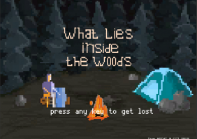
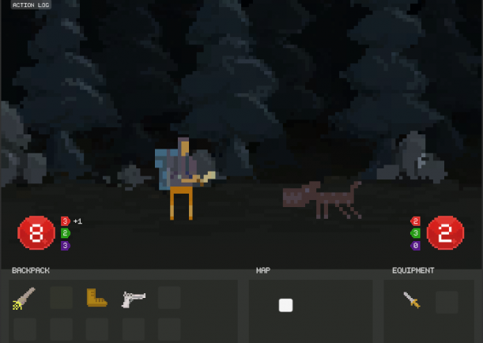

# Previous Works
Markdown document showing my previous works

### Dewa Game App
Tools : Unity 
Year  : TBD 
Link  : - 

### Rogue and River (Tales of Ande-Ande Lumut)
Tools : Unity 
Year  : TBD 
Link  : - 

### Candi Escape (Multiplayer Online)
Tools : Construct 3 / Javascript / WebSocket 
Year  : 2021 
Link  : [Dewa Game](https://dewa.game/launchguest/kts/2) 

### Dewa Run (Multiplayer Online)
Tools : Construct 3 / Javascript / WebSocket 
Year  : 2021 
Link  : [Dewa Game](https://dewa.game/launchguest/kts/5) 

### Dewa Battle Elementak (Multiplayer Online)
Tools : Construct 3 / Javascript / WebSocket 
Year  : 2021 
Link  : [Dewa Game](https://dewa.game/launchguest/kts/8) 

### Bola Mania (Multiplayer Online)
Tools : Phaser / Javascript / WebSocket 
Year  : 2022 
Link  : [Dewa Game](https://dewa.game/launchguest/kts/11) 

### Fishing Mania (Multiplayer Online)
Tools : Phaser / Typescript / WebSocket 
Year  : 2022 
Link  : [Dewa Game](https://dewa.game/launchguest/kts/13) 

### What Lies in the Woods

 
Tools : Unity 
Year : 2019 
Link : [Global Game Jam](https://globalgamejam.org/2019/games/what-lies-in-the-woods) 
