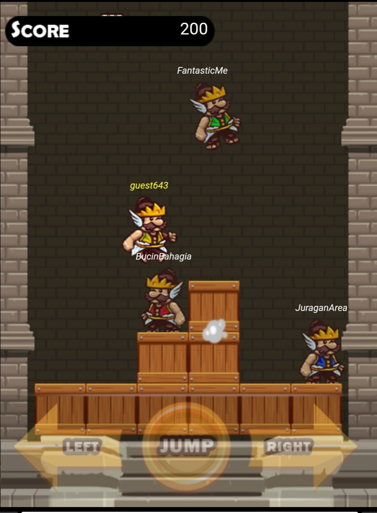
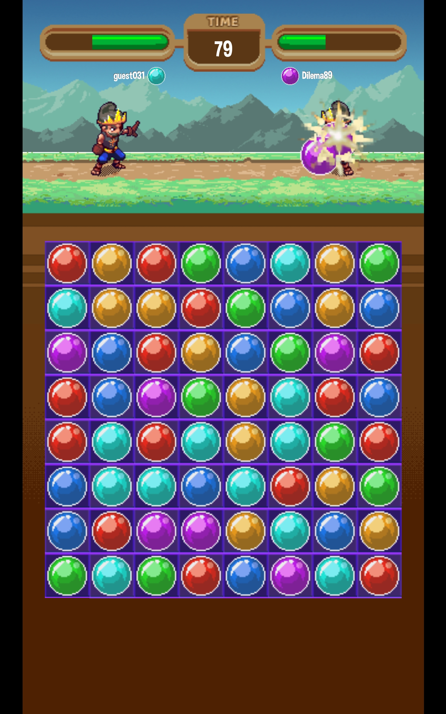
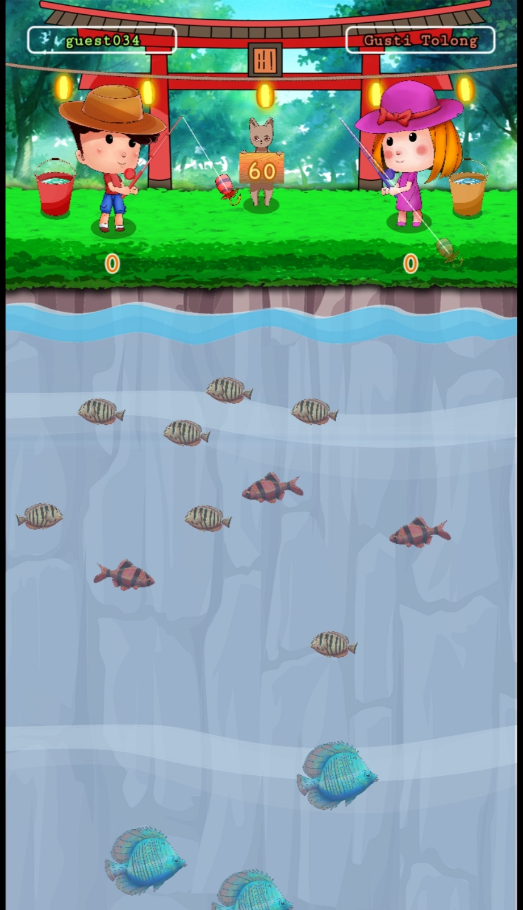
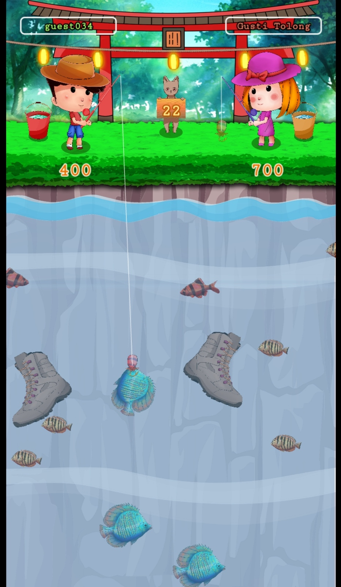

# Previous Works
Markdown document showing my previous works

### Dewa Game App
 
Tools : Unity 
Year  : TBD 
Link  : - 

### Rogue and River (Tales of Ande-Ande Lumut)
Tools : Unity 
Year  : TBD 
Link  : - 

### Candi Escape (Multiplayer Online)
  
Tools : Construct 3 / Javascript / WebSocket 
Year  : 2021 
Link  : [Dewa Game](https://dewa.game/launchguest/kts/2) 

### Dewa Run (Multiplayer Online)
  
Tools : Construct 3 / Javascript / WebSocket 
Year  : 2021 
Link  : [Dewa Game](https://dewa.game/launchguest/kts/5) 

### Dewa Battle Elemental (Multiplayer Online)
  
Tools : Construct 3 / Javascript / WebSocket 
Year  : 2021 
Link  : [Dewa Game](https://dewa.game/launchguest/kts/8) 

### Bola Mania (Multiplayer Online)
  
Tools : Phaser / Javascript / WebSocket 
Year  : 2022 
Link  : [Dewa Game](https://dewa.game/launchguest/kts/11) 

### Fishing Mania (Multiplayer Online)
  
Tools : Phaser / Typescript / WebSocket 
Year  : 2022 
Link  : [Dewa Game](https://dewa.game/launchguest/kts/13) 

### What Lies in the Woods
 
 
Tools : Unity 
Year : 2019 
Link : [Global Game Jam](https://globalgamejam.org/2019/games/what-lies-in-the-woods) 

### Host Recon
  
 
Tools : Construct 2 
Year : 2018 
Link : [Global Game Jam](https://globalgamejam.org/2018/games/host-recon) 

### Rogue Tail
  
 
Tools : Construct 2 
Year : 2017 
Link : [Kiz10](https://kiz10.com/roguetail) 

### Brawl Shot
  
 
Tools : Construct 2 
Year : 2018 
Link : [Github](https://github.com/pineakl/brawl-shot) 
